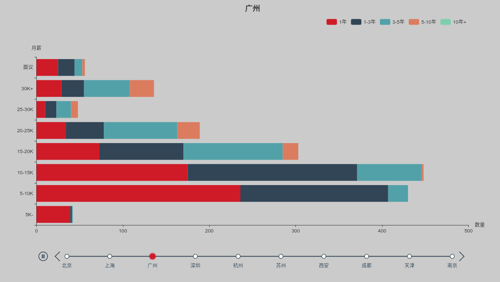
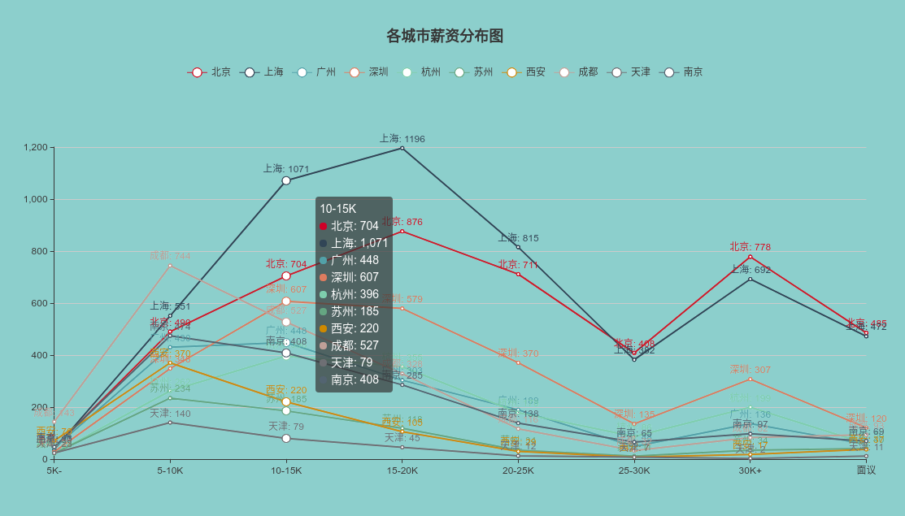
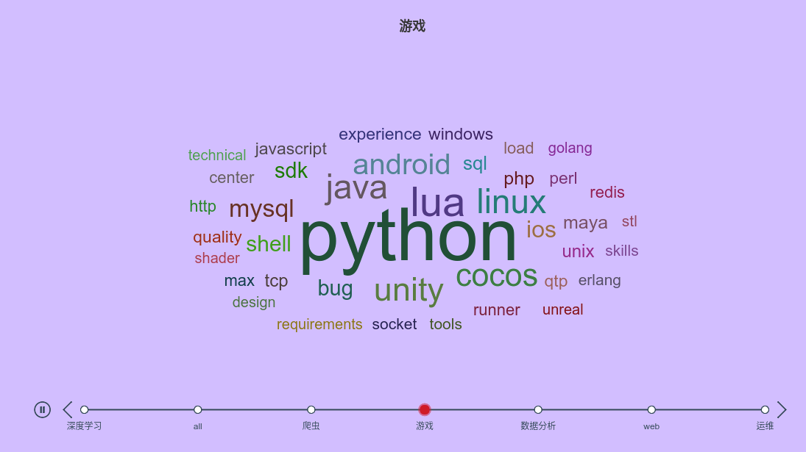
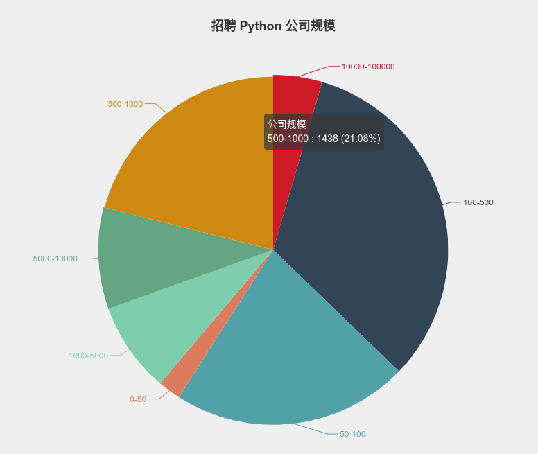
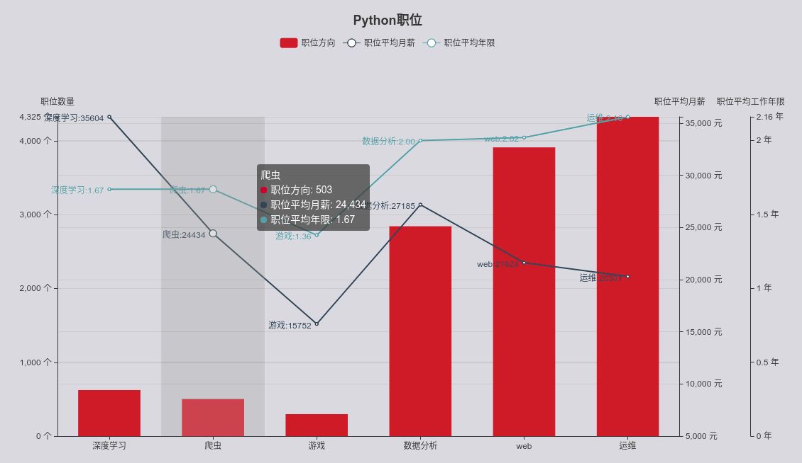
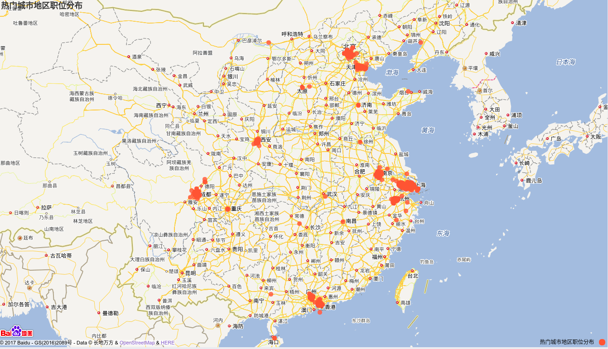

## 爬取招聘网站信息

### 图表说明

#### 图一/二 薪资|城市|年限 分布图




##### 逻辑：

爬下来的数据状态

工作年限有以下几种方式：

- 1年工作经验
- 1-3年工作经验


薪资有以下方式：

- 面议
- 10000 - 15000 
- 9W - 18W

在某年限对应薪资时按照如下逻辑处理

- 1年工作经验 对应 10000 - 15000，取 10000 - 15000 平均数
- 1-3年工作经验 对应 10000 - 15000，1 年对应 10000，3 年对应 15000
- 面议不做处理

按照以上逻辑可以得到许多这样的条目：

```python

# 城市
'上海': {
        '10+': [0, 0, 0, 0, 0, 1, 0, 1],  # 10年工作经验对应薪水 [5K-, 5-10K, ... 30K+, 面议] 数量
        '3-5': [0, 0, 9, 31, 55, 37, 52, 45], 
        '1': [3, 64, 74, 69, 29, 9, 18, 50],
        '5-10': [0, 0, 1, 2, 3, 1, 13, 16], 
        '1-3': [0, 13, 100, 150, 137, 44, 57, 156]
        }
# 其他城市
# ...


```

按照此条目作出图形


#### 图三 各方向技术关键词



逻辑

1、 根据职位名和职位描述做正则匹配

匹配标准
```python

keywords = ['运维|监控',
            'web|后端|后台|服务端|django|flask|网络开发|tornado',
            '数据分析|大数据|hadoop|spark',
            '爬虫|挖掘|抓取|scrapy|pyspider',
            '游戏|手游|cocos',
            '深度学习|识别|机器学习|神经网络|tensorflow'
            ]
            
```
举例： 当职位名或者职位描述中出现了 '运维', 即认为改职位与运维相关。其他词汇一样。

2、 累加各方向职位描述

确定好该职位为某一特定方向后，将该职位的职位描述累加，最后得到一个很长的字符串。
再次使用正则匹配出所有的英文词汇，去除一些无用的词汇，最后提取出出现词频较高的词汇，做成词云图。


#### 图四 公司规模



逻辑

1、 爬取时做去重处理

在爬取的过程中，考虑到一个公司可能有多个职位，公司信息和职位信息做分别处理，保证数据库内某一公司不会出现重复。

2、 提取公司规模

爬取的公司都含有规模信息，大致分为以下几个等级：

- 0 - 50
- 50 - 100
- 100 - 500
- 500 - 1000
- 1000 - 5000
- 5000 - 10000
- 10000 - 100000

3、在提取公司的过程中做了异常公司筛选，去掉了某些打着招聘旗号的培训机构

- 去掉一些众所周知的培训机构，比如 某内， 某马等等
- 在分析时发现，某些公司招聘人数在 5 人以上，同时其公司名中含有 '教育/培训' 的公司多为培训机构。
- 还有一些公司，招聘人数超过 5 人，经手工百度之后，发现为培训机构，也一并去除。
- 最后在网络上找了一份打着招聘旗号，实际上却是培训机构的公司名单，比对数据库，剔除这些公司。


#### 图五 各方向职位数以及平均薪水



1、 认定职位方向
借用的处理图四的逻辑，按照

```python

keywords = ['运维|监控',
            'web|后端|后台|服务端|django|flask|网络开发|tornado',
            '数据分析|大数据|hadoop|spark',
            '爬虫|挖掘|抓取|scrapy|pyspider',
            '游戏|手游|cocos',
            '深度学习|识别|机器学习|神经网络|tensorflow'
            ]
            
```

匹配标准，进行职位方向认定。

2、认定职位薪水

薪资有以下方式：

- 面议
- 10000 - 15000 
- 9W - 18W

直接跳过面议岗位，对目前职位的薪水取平均值，比如 10000 - 15000 则取 12500，然后累加。最后除以职位总数，得到该方向平均值。

3、 认定职位年限

年限有如下方式：

- 经验不限
- 1-3 年经验
- 3 年经验

处理的时候将经验不限处理为 0 年， 1-3 年取平均值 2 年， 3年经验就取 3 年。

```python

{
'运维': [1656, 27383506, 3811], # '职位方向'： [职位数量， 平均薪水总和， 平均年限总和]
'web': [1833, 30331159, 4087], 
'深度学习': [235, 5455734, 451], 
'游戏': [130, 1531494, 170], 
'数据分析': [1089, 22611427, 2323], 
'爬虫': [223, 4097155, 427]}
 
```

#### 图六 地图



数据来源包含两方面

1. 大多数招聘网页上含有该公司的经纬度信息
2. 通过高德 API 接口搜索该公司的地址获取经纬度

数据获取之后接入百度地图，将经纬点呈现在地图上


### 文件框架

- backend 为 django 后端
- crawlend 为 scrapy 爬虫端
- utils 包含分析数据库，调用高德 API 获取经纬度脚本。


 
### 技术总结

1、 将 scrapy 集成到 django 中

在做项目之前，就希望把 scrapy 集成到 django 中，爬下的数据直接通过 django-orm 存储到数据库中，这样在之后数据分析中，无缝的连接数据和后端处理。同时借助 django-admin 可以随时查看数据状况。

简单文件结构如下：

```
├── backend // django APP
├── crawlend // scrapy 
├── manage.py
├── recruitment // django project
└── utils // others

```

scrapy 集成到 django 的思路是在 scrapy 运行时启动一个 django 环境， pipeline 处理完数据之后，直接通过独立的 django 环境存储数据。

代码配置如下：

crawlend/settings.py

初始化独立的 django 环境
```python

import os, django
import sys
BASE_DIR = os.path.dirname(os.path.dirname(os.path.dirname(os.path.abspath(__file__))))
sys.path.append(BASE_DIR)
os.environ.setdefault("DJANGO_SETTINGS_MODULE", "recruitment.server_settings")
django.setup()

# ...
```
crawlend/items.py
```python

# 引入 scrapy_djangoitem 包作为 django-scrapy 存储中介
# Recruit 为 django.models 中定义的数据模型

from scrapy_djangoitem import DjangoItem
from backend.models import Recruit


class CrawlendItem(DjangoItem):
    django_model = Recruit
    
 
```
这里使用到了 scrapy_djangoitem 包，需要 `pip` 安装， 详情可参考 [scrapy-djangoitem](https://pypi.python.org/pypi/scrapy-djangoitem/1.1.1)

crawlend/pipelines.py

在 pipelines 中保存处理
```python
class CrawlendPipeline(object):

    def process_item(self, item, spider):

        # 测试用
        if isinstance(item, CrawlendItem):
            item.save()
            return item
            
```


2、 爬虫端代理中间件

在 middlewares.py 文件中，构造了两个中间件,以其中一个为例：

```python

# 更改 UA 中间件
class UAMiddleWare():

    def __init__(self):
        
        self.useragents = [
            # safari 5.1 – MAC
            {'User-Agent': 'Mozilla/5.0 (Macintosh; U; Intel Mac OS X 10_6_8; en-us) AppleWebKit/534.50 (KHTML, like Gecko) Version/5.1 Safari/534.50'},
            # safari 5.1 – Windows
            {'User-Agent': 'Mozilla/5.0 (Windows; U; Windows NT 6.1; en-us) AppleWebKit/534.50 (KHTML, like Gecko) Version/5.1 Safari/534.50'}
            ]
    def process_request(self, request, spider):
        request.headers.setdefault("User-Agent", random.choice(self.useragents)['User-Agent'])
        logger.debug("construct request with UA: {}".format(request.headers))

```

更多的关于中间件的知识参考： [Downloader Middleware](https://docs.scrapy.org/en/latest/topics/downloader-middleware.html)

